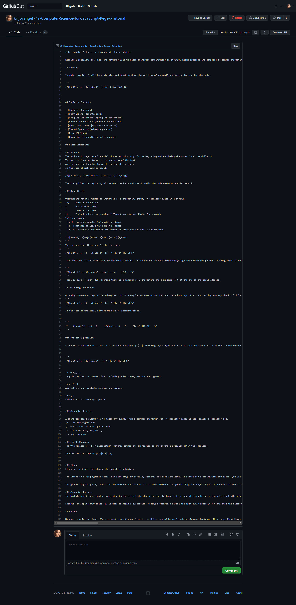

# 17-Computer-Science-for-JavaScript-Regex-Tutorial

## Introduction:
Our assignment was to create a tutorial that explains how a specific regular expression, or regex, functions. By breaking down each part of the expression and then describing what it does. A starter code template was provided to create the walkthrough.


[Matching an Email: Regex tutorial gist](https://gist.github.com/killjoyangel/b125f4442db2b87c75119b5df1ad461f)
```
 Matching an email:
 /^([a-z0-9_\.-]+)@([\da-z\.-]+)\.([a-z\.]{2,6})$/
```

<br>
<br>


## Technologies used:

* Mark down
* Google
<br>
<br>

## Screenshot of Final tutorial


<br>
<br>

[](https://opensource.org/licenses/MIT)


